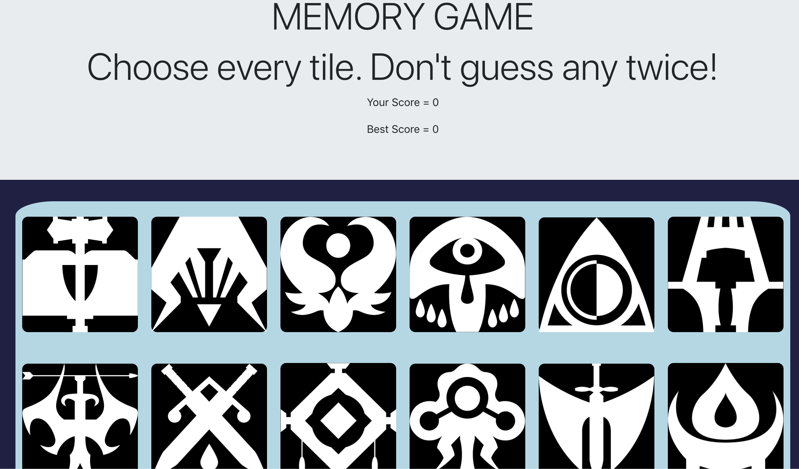

# REACT MEMORY

## Implementing React front-end concepts into a mobile responsive game function. 

### Demonstrating usage of the main React concepts. Utilized state, classes, and functional components. Connected the pieces together by calling components in and passing props through them. 

### Next, using the JSX format, I wrote a conditional series to check the tile for having been clicked already and handling the score. On click methods include a modified javascript shuffle function to grab a random amount of tiles and shuffle their position on the screen. As soon as the player clicks a tile, they will shuffle around and test their memory! 

